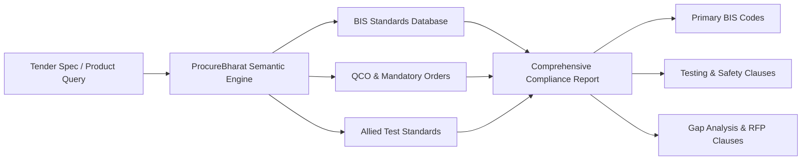

<div align="center">

# 🇮🇳 ProcureBharat (प्रोक्योर भारत)
### AI-Powered Indian Standards (BIS) Intelligence for Smarter Public & Enterprise Procurement

[](https://nextjs.org/)
[](https://developer.mozilla.org/en-US/docs/Web/JavaScript)
[](https://tailwindcss.com/)
[](https://www.bis.gov.in/)
[](https://opensource.org/licenses/MIT)

<p align="center">
  <b>ProcureBharat</b> is a next-generation procurement intelligence platform designed to eliminate compliance risks, tender ambiguities, and audit vulnerabilities across Indian public and private sector procurement workflows (GeM, CPPP, Railways, Defense, PSUs, and EPC contractors).
</p>

[Explore Features](#-key-features) •
[Quick Start](#-quick-start) •
[Tech Stack](#-technology-stack) •
[Supported Sectors](#-key-sectors--standards-coverage) •
[Workflow](#-how-it-works)

---

</div>

## 📌 The Problem

Public procurement in India mandates rigorous compliance with **Bureau of Indian Standards (BIS)**, **Quality Control Orders (QCOs)**, and national regulatory guidelines. However, procurement teams frequently encounter:

- **Obsolete IS Codes**: Specifying withdrawn or superseded Indian Standards in tenders.
- **Missing Allied Standards**: Omitting required safety, ingress protection (IP), environmental, or component-level standards.
- **QCO Non-Compliance**: Overlooking mandatory certification orders, leading to bid rejection or legal disputes.
- **Vendor Misalignment**: Discrepancies between tender technical specifications and standard testing protocols.

**ProcureBharat** bridges this gap using an intelligent semantic engine that maps tender technical descriptions directly to the exact, up-to-date Indian Standards, allied test standards, mandatory QCOs, and recommended tender clauses.

---

## ✨ Key Features

### 🔍 1. AI Standards Recommendation Engine
- **Natural Language & Semantic Matching**: Input product descriptions, tender technical parameters, or procurement queries in plain language.
- **Primary & Allied Standards Mapping**: Automatically identifies primary product standards alongside allied standards (safety, fire resistance, ingress, electrical insulation, mechanical tests).
- **Superseded & Amendment Tracking**: Highlights the latest revisions, in-force amendments, and superseded standard warnings to prevent obsolete specs in RFPs.

### 📑 2. Tender Document & Clause Analyzer
- **Clause Extraction**: Upload or paste tender RFP documents to parse technical requirement clauses.
- **Instant Compliance Scoring**: Evaluates the tender against mandatory BIS certifications and flags vague or non-compliant technical clauses.
- **Automated Clause Enhancer**: Provides ready-to-copy, legally sound tender clauses incorporating verified BIS standards.

### ⚠️ 3. Procurement Gap Analysis
- Identifies critical gaps such as missing endurance tests, safety parameters, environmental ratings, and certification requirements.
- Generates a **Severity Matrix** (Critical, Moderate, Advisory) to resolve technical ambiguities prior to tender floatation.

### 🛡️ 4. Quality Control Orders (QCO) Radar
- Real-time cataloging of mandatory BIS certification items notified under Indian Quality Control Orders.
- Verifies whether an item requires compulsory ISI mark or Scheme-II (CRS) registration before procurement.

### 🌐 5. Multilingual Procurement Interface
- Built for pan-India accessibility with multi-language support:
  - **English** (Standard Technical)
  - **Hindi (हिंदी)** (Official Hindi terminology)
  - **Hinglish** (Colloquial mix for procurement field teams)

### 📊 6. Audit-Ready Export Dossiers
- Export detailed technical compliance reports in PDF/JSON formats for tender committee approvals, GeM bid creation, and audit trails.
- Bookmarking & history tracking for quick retrieval of frequently procured categories.

---

## 🏭 Key Sectors & Standards Coverage

ProcureBharat includes comprehensive domain knowledge across major procurement categories:

| Sector | Core Standards Covered | Key Focus Areas |
| :--- | :--- | :--- |
| **⚡ Electrical & Power** | `IS 10322`, `IS 694`, `IS 1180`, `IS 16102` | LED luminaires, LV/HV cables, distribution transformers, smart meters |
| **🏗️ Civil & Infrastructure** | `IS 456`, `IS 269`, `IS 1786`, `IS 4984` | Plain & reinforced concrete, Portland cement, TMT rebars, HDPE pipes |
| **☀️ Renewable Energy** | `IS 16221`, `IS 14286`, `IS/IEC 61730` | Solar PV modules, grid inverters, battery storage compliance |
| **🦺 Industrial Safety & PPE** | `IS 2925`, `IS 15298`, `IS 9473` | Industrial safety helmets, protective footwear, respiratory half-masks |
| **🚗 Mechanical & Industrial** | `IS 2062`, `IS 1239`, `IS 1538` | Structural steel, mild steel tubes, cast iron fittings |

---

## 🛠️ Technology Stack

- **Frontend**: [Next.js](https://nextjs.org/), [Tailwind CSS v4](https://tailwindcss.com/), [JavaScript (ES6+)](https://developer.mozilla.org/en-US/docs/Web/JavaScript), [Lucide React](https://lucide.dev/)
- **Backend**: [Node.js](https://nodejs.org/) / [Express.js](https://expressjs.com/), REST APIs
- **Database**: [Supabase](https://supabase.com/), [PostgreSQL](https://www.postgresql.org/), [pgvector](https://github.com/pgvector/pgvector), Supabase Auth, RLS (Row Level Security), Supabase Storage
- **AI & Analytics Stack**: LLM API (OpenAI), Vector Search, RAG (Retrieval-Augmented Generation), Embedding Model, Semantic Search
- **Development & Deployment**: Git, GitHub, Postman, [Vercel](https://vercel.com/) (Frontend), [Render](https://render.com/) (Backend)

---

## 🚀 Quick Start

### Prerequisites
- [Node.js](https://nodejs.org/) (version 18.0.0 or higher recommended)
- `npm` (bundled with Node.js) or `pnpm` / `yarn`

### 1. Clone the Repository
```bash
git clone https://github.com/mrsatyampatel/ProcureBharat.git
cd ProcureBharat
```

### 2. Install Dependencies
```bash
npm install
```

### 3. Start the Development Server
```bash
npm run dev
```

Open your browser and navigate to:
```
http://localhost:3000
```

### 4. Build for Production
```bash
npm run build
```
The optimized production build will be generated in the `.next/` directory.

---

## 📂 Project Structure

```
ProcureBharat/
├── package.json                 # Next.js scripts and dependencies
├── jsconfig.json                # Path alias configuration (@/*)
├── next.config.mjs              # Next.js configuration
├── postcss.config.mjs           # Tailwind CSS v4 PostCSS configuration
├── src/
│   ├── app/
│   │   ├── layout.jsx           # Root layout with fonts & metadata
│   │   ├── page.jsx             # Next.js page entry
│   │   └── globals.css          # Tailwind CSS v4 imports & theme variables
│   ├── App.jsx                  # Main application state orchestration
│   ├── data/
│   │   └── standardsDataset.js  # Curated database of BIS standards, amendments, & samples
│   ├── services/
│   │   └── aiRecommendationEngine.js # Semantic standards correlation & analysis engine
│   ├── types/
│   │   └── standards.js         # Standards definitions and constants
│   └── components/
│       ├── layout/              # Header, Sidebar, and App Navigation (.jsx)
│       ├── dashboard/           # Home dashboard with metrics and quick actions (.jsx)
│       ├── finder/              # Standards AI Finder view (.jsx)
│       ├── documents/           # Tender document analyzer and clause parser (.jsx)
│       ├── results/             # Analysis breakdown and recommendations (.jsx)
│       ├── compliance/          # GeM and public procurement compliance checklist (.jsx)
│       ├── gap-analysis/        # Gap detection and missing clause recommendations (.jsx)
│       ├── product-groups/      # Product category browsing (.jsx)
│       ├── saved/               # Bookmarked standards management (.jsx)
│       ├── history/             # Audit logs and previous analysis history (.jsx)
│       ├── report/              # Report viewer and export modal (.jsx)
│       └── help/                # Guidance and user documentation (.jsx)
```

---

## 🎯 How It Works



1. **Input Tender Specification**: Paste technical specifications or select from standard public tender templates.
2. **Semantic Correlation**: The engine identifies the product classification, primary applications, operational environment, and safety risks.
3. **Standards Cross-Referencing**: Maps primary BIS product standards alongside allied standards (e.g. testing protocols, IP ratings, electrical safety).
4. **Actionable Output**: Delivers an actionable dossier containing exact standard numbers, amendment status, mandatory QCO notices, and recommended tender clauses.

---

## 🤝 Contributing

Contributions are welcome! If you would like to expand the standards database, add new product categories, or enhance the analysis engine:

1. Fork the Project (`https://github.com/mrsatyampatel/ProcureBharat/fork`)
2. Create your Feature Branch (`git checkout -b feature/NewStandardCategory`)
3. Commit your Changes (`git commit -m 'Add new standards category'`)
4. Push to the Branch (`git push origin feature/NewStandardCategory`)
5. Open a Pull Request

---

## 📜 License

Distributed under the **MIT License**. See `LICENSE` for more information.

---

<div align="center">
  <sub>Built with ❤️ for Indian Public Procurement & Atmanirbhar Bharat.</sub>
</div>
